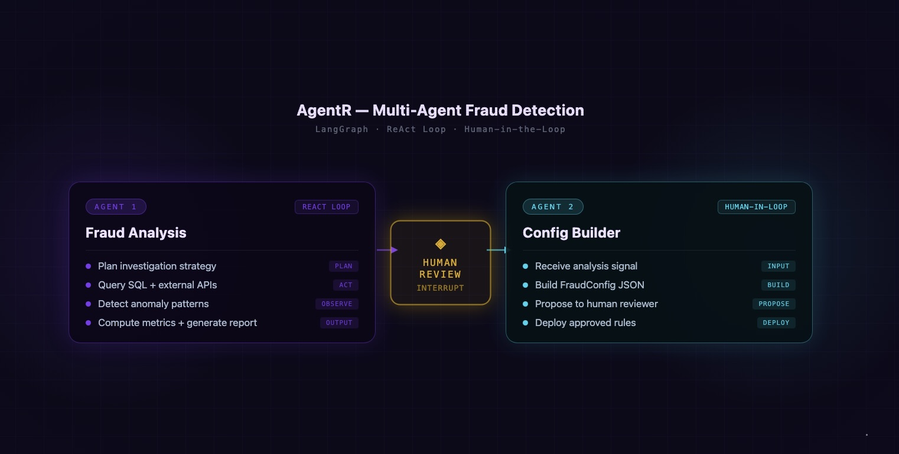
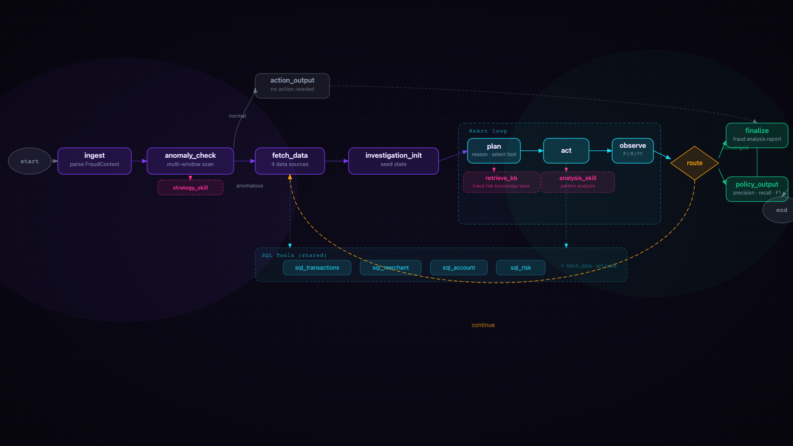
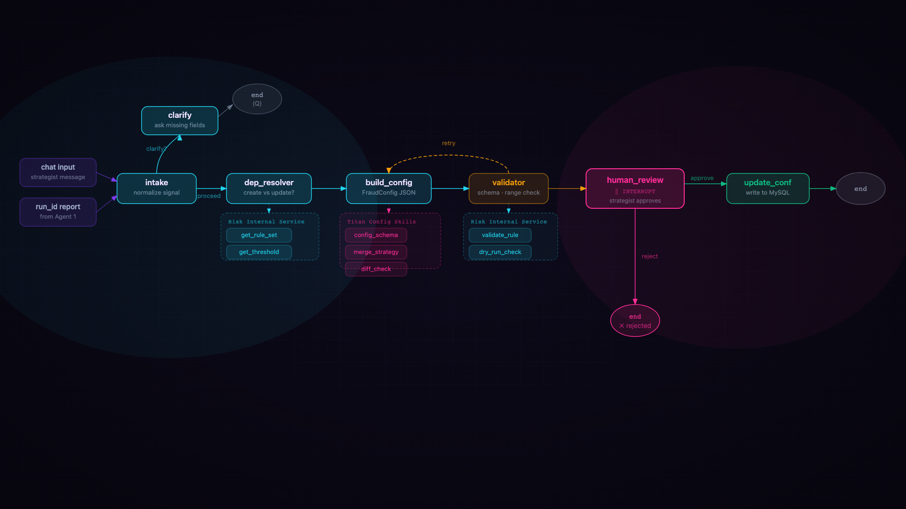

# AgentR — Fraud Risk AI Agent System

**AgentR** là hệ thống AI agent nội bộ được xây dựng cho đội ngũ **Risk Management** tại **ZaloPay**. Hàng ngày phải đối mặt với bài toán **phát hiện gian lận** trong một hệ thống giao dịch vận hành liên tục, khối lượng lớn và các pattern tấn công không ngừng thay đổi.

Bài toán cốt lõi không phải là thiếu dữ liệu mà là khoảng cách quá lớn giữa lúc một tín hiệu bất thường xuất hiện và lúc nó trở thành một rule thực sự chặn được gian lận. Quy trình truyền thống đòi hỏi strategist phải đọc report, tự điều tra, phân tích data, phát hiện hành vi bất thường tiến đến thiết lập các rule vào hệ thống. Công việc tốn thời gian, dễ bỏ sót và không thể scale kịp tốc độ của fraud.

AgentR giải quyết điều đó bằng cách tự động hóa toàn bộ vòng điều tra: nhận tín hiệu từ stakeholders, tự đặt hypothesis, với bộ skill của fraud risk analysis thực hiện phân tích data để tìm pattern có đủ độ tin cậy, rồi tổng hợp thành rule config sẵn sàng deploy. AgentR phối hợp cùng strategist để đưa ra các quyết định quan trọng trong quy trình.

Quá trình xử lý được rút ngắn từ **vài ngày** xuống chỉ còn **vài phút**.

#### 🎬 Demo Video — [AgentR Demo Video](https://drive.google.com/file/d/1WhqAe3MZY7t7ty3yZCI6fXF9nR2V59Zw/view?usp=sharing)

---

## Kiến trúc hệ thống



| Service | Vai trò | Port |
|---|---|---|
| **`mcp-server/`** | MCP tool server (fastmcp) — quản lý toàn bộ tool call của 2 agent: warehouse queries, metrics, config CRUD, session memory | `8000` |
| **`fraud-analysis-agent/`** | Risk Analysis Agent — phát hiện anomaly + điều tra ReAct + sinh RuleJSON, Fraud Analysis Report | `8081` |
| **`fraud-config-agent-v2/`** | Config Agent — reasoning từ fraud signal thành rule config, ghi MySQL sau human review | `8082` |
| **`risk-portal-ui/`** | Frontend React + Vite cho Risk Portal | `3000` |

Cả hai agent là **MCP clients** — mọi tool call (truy vấn warehouse, tính metrics, đọc/ghi config, lưu session) đều đi qua MCP server thay vì gọi trực tiếp MySQL.

---

## 1. MCP Server (`mcp-server/`)

Triển khai bằng **fastmcp** với transport `streamable-http` (port `8000`). Đây là nơi tập trung toàn bộ logic tool:

| Nhóm | Tools |
|---|---|
| **Shared** | `query_with_filters`, `aggregate`, `raw_sql`, `get_schema` |
| **Investigation** | `compute_metrics`, `fetch_anomaly_baselines`, `notify_strategist` |
| **Config** | `get_config`, `save_config`, `list_configs`, `get_session`, `save_session`, `append_session`, `fetch_fraud_report` |

---

## 2. Agent 1 — `fraud-analysis-agent`

Agent LangGraph phát hiện làn sóng gian lận mới nổi từ report, điều tra trên warehouse bằng vòng lặp **ReAct**, và phát ra **RuleJSON** (gợi ý policy) kèm toàn bộ trace điều tra để audit.

### Workflow



**Các node** (`app/nodes/`):

- **`ingest`** — parse email / post-mortem JSON thành `FraudContext`. _LLM role `ingest`._
- **`anomaly_check`** — gọi `fetch_anomaly_baselines` qua MCP (9 cửa sổ thời gian: week/month/rolling), áp trigger rule từ `strategy.md`. Trả `AnomalyDecision` và route. _LLM role `anomaly`._
- **`action_output`** — nếu không anomaly: phát `NoActionReport` rồi kết thúc.
- **Vòng điều tra ReAct** (`investigation/`):
  - **`init_node`** — nạp `kb.md` (catalog metric, threshold) và `skill.md` (chiến lược thinking), khởi tạo bộ đếm.
  - **`plan`** — LLM chọn tool kế tiếp + hypothesis đang test. _LLM role `plan`._
  - **`act`** — gọi tool qua MCP: `query_with_filters`, `aggregate`, `compute_metrics`, `raw_sql`.
  - **`observe`** — LLM phân tích kết quả, ghi `PatternAttempt`; metrics được tính lại bằng code. _LLM role `observe`._
  - **`router`** — guard vòng lặp: `converged` / `continue` / `max_iter` / `no_pattern`.
- **`finalize_investigation`** — chọn pattern F1 tốt nhất, dựng `InvestigationReport`.
- **`policy_output`** — dựng `RuleJSON` + `pretty_report` markdown.

### API

| Method | Endpoint | Ghi chú |
|---|---|---|
| POST | `/runs` | Tạo run (async background task), trả `run_id` |
| GET | `/runs/{run_id}` | Poll trạng thái + snapshot report |
| GET | `/runs/{run_id}/stream` | SSE stream các bước điều tra |
| DELETE | `/runs/{run_id}` | Hủy run |
| GET | `/runs` | List run_id |
| POST | `/triggers/email` | Webhook email → `/runs` |
| POST | `/triggers/postmortem` | Webhook post-mortem → `/runs` |
| GET | `/health` | Health probe |

### Tech

Python ≥ 3.13 · LangGraph · FastAPI · Pydantic v2 · OpenAI-compatible · SQLAlchemy + PyMySQL · httpx (MCP client)

---

## 3. Agent 2 — `fraud-config-agent-v2`

Agent chat reasoning biến một fraud signal thành **rule config triển khai được** (`FraudConfig` JSON), ghi vào MySQL `risk_db.rule_config` sau khi strategist xác nhận.

Hai đường vào:

1. **Manual chat** — strategist mô tả pattern bằng ngôn ngữ tự nhiên (hỗ trợ tiếng Việt).
2. **From report** — kéo run đã hoàn tất của `fraud-analysis-agent` theo `run_id`, đọc `final_pattern` + `recommendation` và tự reason ra config.

### Workflow



**Các node** (`agent/nodes.py`):

- **`intake`** (LLM) — normalize chat text hoặc report thành `requirement`.
- **`clarify`** (LLM) — hỏi tối đa 1 câu khi thiếu field bắt buộc; history lưu theo session.
- **`dependency_resolver`** (tool) — dedup mức rule qua MCP `get_config`: rule đã tồn tại → `update`, chưa có → `create`.
- **`build_config`** (LLM) — phát `FraudConfig` events JSON; merge vào event hiện có khi update.
- **`validator`** (tool) — validate Pydantic + vòng retry.
- **`human_review`** — interrupt; strategist approve/reject.
- **`update_conf`** (tool) — khi approve: `save_config` qua MCP + lưu file plan `output/` + `append_session` breadcrumb.

### Output: `FraudConfig` JSON

```
FraudConfig → events[]
  Event     → name, description, filter("AND"/"OR"), actionCode, decisionCode, variables[], rules[]
  Rule      → name, description, conditions[], infoCode
  Condition → field, operator, value
  Variable  → fieldName, fieldType("LONG"/"DOUBLE"/"STRING"), source:{keyId}
```

Operator: `GREATER_THAN(_OR_EQUAL)`, `LESS_THAN(_OR_EQUAL)`, `EQUALS`, `NOT_EQUALS`, `CONTAINS`.

### API

| Method | Path | Purpose |
|---|---|---|
| POST | `/chat` | Đường manual; trả `clarify` hoặc `awaiting_review` |
| POST | `/runs/from-report` | Kéo report theo `run_id`, build config |
| GET | `/runs/{id}` | Poll trạng thái + config plan |
| POST | `/runs/{id}/review` | `{decision: approve\|reject}` — resume qua interrupt |
| GET | `/runs`, `/rules`, `/configs`, `/health` | Listings / rules đã deploy / health |
| GET | `/` | Chat UI tĩnh (`static/index.html`) |

### Tech

Python 3.11 · LangGraph (SqliteSaver) · FastAPI · Pydantic v2 · OpenAI SDK · httpx (MCP client)

---

## 4. Tầng dữ liệu (MySQL `risk_db`)

Truy cập hoàn toàn qua MCP server — các agent không kết nối MySQL trực tiếp.

| Bảng | Vai trò |
|---|---|
| `trans_log` | Toàn bộ giao dịch |
| `pom_acr` | Subset fraud đã xác nhận (fraud_type, is_loss, report_date) |
| `user_profile` | Thông tin user (KYC, NFC, trust flags) |
| `user_journey` | Event log per user (register, login, map_card, eKYC…) |
| `rule_config` | Output của Config Agent: rule đã duyệt (event_name, config_json, status, source_run_id) |

---

## 5. Chạy local

```bash
# Khởi động toàn bộ stack
docker compose up -d

# Services
# mcp-server          → http://localhost:8000
# fraud-analysis-agent → http://localhost:8081
# fraud-config-agent-v2 → http://localhost:8082
# risk-portal-ui       → http://localhost:3000
```

Cấu hình qua `.env` (xem `.env.example`):

```
LLM_API_KEY=...
LLM_BASE_URL=...
LLM_MODEL=...
MYSQL_HOST=...
MYSQL_PORT=3306
MYSQL_DB=risk_db
MYSQL_USER=...
MYSQL_PASSWORD=...
```
