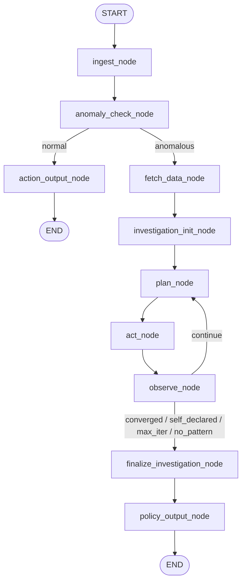
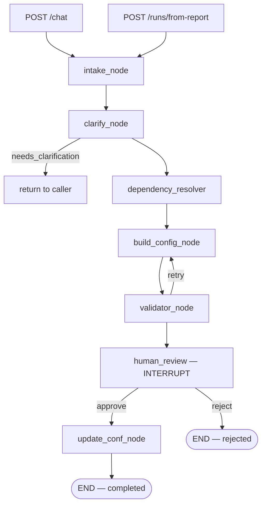

# AgentR — System Workflow

End-to-end workflow of the AgentR system. Updated 2026-06-24.

---

## 1. Overview

AgentR gồm 3 service chính:

| Service | Vai trò |
|---|---|
| **MCP Server** | Centralized tool server — quản lý toàn bộ tool call, truy vấn warehouse, metrics, config, session |
| **Fraud Analysis Agent** | Nhận fraud report, phát hiện anomaly, điều tra ReAct, sinh RuleJSON |
| **Config Agent v2** | Nhận fraud signal (chat hoặc report), reason ra FraudConfig, ghi MySQL sau human review |

Hai agent là **MCP clients** — mọi tool call đều đi qua MCP server (JSON-RPC 2.0 over HTTP/SSE). Agent không kết nối MySQL trực tiếp.

---

## 2. Kiến trúc MCP

```
┌─────────────────────────────────────────────────────┐
│                    MCP Server :8000                  │
│                                                      │
│  tools/shared.py          tools/investigation.py     │
│  ├─ query_with_filters    ├─ compute_metrics         │
│  ├─ aggregate             ├─ fetch_anomaly_baselines │
│  ├─ raw_sql               └─ notify_strategist       │
│  └─ get_schema                                       │
│                           tools/config.py            │
│  db/warehouse.py          ├─ get_config              │
│  db/sql_safety.py         ├─ save_config             │
│                           ├─ list_configs            │
│                           ├─ get_session             │
│                           ├─ save_session            │
│                           ├─ append_session          │
│                           └─ fetch_fraud_report      │
└──────────────────┬────────────────┬─────────────────┘
                   │ MCP client     │ MCP client
        ┌──────────┴──┐         ┌───┴──────────────┐
        │  fraud-      │         │  fraud-config-   │
        │  analysis-   │         │  agent-v2 :8082  │
        │  agent :8081 │         │                  │
        └─────────────┘         └──────────────────┘
```

**MCPClient** (httpx sync):
1. POST `initialize` → nhận `mcp-session-id` từ response header
2. POST `tools/call` với header `mcp-session-id` cho mọi lần gọi tiếp theo

---

## 3. Fraud Analysis Agent

### 3.1 Topology

```
START → ingest → anomaly_check ──── normal ────→ action_output → END
                       │
                       └── anomalous ──→ fetch_data → investigation_init
                                                            │
                                                            ▼
                                                          plan ◄────┐
                                                            │       │ continue
                                                            ▼       │
                                                           act      │
                                                            │       │
                                                            ▼       │
                                                         observe ───┘
                                                            │
                                          converged / self_declared /
                                          max_iter / no_pattern
                                                            │
                                                            ▼
                                               finalize_investigation
                                                            │
                                                            ▼
                                                    policy_output → END
```



### 3.2 Phase 1 — Ingest & Triage

#### `ingest_node`

| Aspect | Detail |
|---|---|
| Role | LLM (`LLM_MODEL_INGEST`) |
| Input | `source_type`, `raw_input` (email body hoặc post-mortem JSON) |
| Output | `fraud_context` (FraudContext: reported_cases, severity, time_hint, raw_summary) |

```json
{
  "fraud_context": {
    "reported_cases": [{ "appID": 5210, "transID": "...", "userChargeAmount": 12000000, "bankType": "international", "fraud_type": "CF" }],
    "severity": "high",
    "time_hint": "last 90 days",
    "raw_summary": "Chargeback fraud diện rộng trên thẻ quốc tế..."
  }
}
```

#### `anomaly_check_node`

| Aspect | Detail |
|---|---|
| Role | LLM (`LLM_MODEL_ANOMALY`) + MCP tool |
| MCP call | `fetch_anomaly_baselines(dimensions=[...])` — trả 9 cửa sổ thời gian đã aggregated |
| Dimensions | `appID, integratedChannel, bankType, bankCode, is_kyc` (cấu hình qua `strategy.md` frontmatter) |
| Trigger rules | Định nghĩa trong `strategy.md` body: **A-series amount**, **B-series count**, **C-series concentration** |
| Output | `AnomalyDecision` — `is_anomalous`, `confidence`, `reasoning`, `evidence: [{filters, observation}]` |

**9 cửa sổ từ `fetch_anomaly_baselines`:**

| Window | Ý nghĩa |
|---|---|
| `current_week` | Tuần này (T2 → hôm nay) |
| `prev_week` | Tuần trước (7 ngày đầy đủ) |
| `current_month` | Tháng này đến nay |
| `prev_month` | Tháng trước đầy đủ |
| `today` | D0 |
| `yesterday` | D-1 |
| `rolling_7d` | 7 ngày gần nhất |
| `rolling_7d_prev` | 7 ngày trước đó |
| `avg_4w` | Trung bình 4 tuần trước W0 (totals ÷ 4) |

Mỗi window: `{label, start, end, total_count, total_amount_vnd, by_<dim>: [...]}`.

**Routing:** `anomaly_route(state) → "anomalous" | "normal"`

#### `action_output_node` (normal branch → END)

- Tool-only, không LLM.
- Phát `NoActionReport` + gọi `notify_strategist` qua MCP + render `pretty_report` markdown.

### 3.3 Phase 2 — Targeted Retrieval

#### `fetch_data_node`

| Aspect | Detail |
|---|---|
| Role | Tool-only (không LLM) |
| Input | `anomaly_decision.evidence: [{filters, observation}]` |
| MCP calls | `query_with_filters("pom_acr", filters, window)` + `query_with_filters("trans_log", filters, window)` per evidence |
| Window | `compute_investigation_window(now)` = `[first_day_of_prev_month, today]` |
| Schema | `get_schema(["trans_log", "pom_acr", "user_profile", "user_journey"])` |
| Output | `investigation_window`, `investigation_slices`, `fetch_strategy_body`, `data_schema` |

`investigation_slices` shape:
```json
{
  "bankType=international": {
    "filters": {"bankType": "international"},
    "observation": "reported 100% international vs baseline ~45%",
    "pom":   {"count": 294, "sample_rows": [...]},
    "trans": {"count": 1908, "sample_rows": [...]}
  }
}
```

### 3.4 Phase 3 — Agentic Investigation (ReAct)

#### `investigation_init_node`

- Tool-only. Nạp `kb.md` và `skill.md`, khởi tạo counters.
- State init: `investigation_iteration=0`, `investigation_log=[]`, `patterns_attempted=[]`.

#### `plan_node` (LLM)

| Aspect | Detail |
|---|---|
| Role | LLM (`LLM_MODEL_PLAN`) |
| Prompt | ROLE + KB body + SKILL body + `TOOL_REGISTRY_SPEC` + OUTPUT_SCHEMA |
| User payload | iteration N + anomaly_summary + investigation_slices overview + data_schema + last 3 log entries + top patterns by F1 |
| Output | `current_step`: `{iteration, plan_thought, tool, args, hypothesis_being_tested}` |

`TOOL_REGISTRY_SPEC` là string spec embed vào prompt — describe 4 MCP tools (`query_with_filters`, `aggregate`, `compute_metrics`, `raw_sql`) với args và return format.

#### `act_node`

| Aspect | Detail |
|---|---|
| Role | Tool dispatcher (không LLM) |
| Dispatch | `call_tool(step.tool, **step.args)` qua MCPClient |
| Unknown tool | Returns `{"error": "unknown tool '...'; valid: [...]"}` |
| Errors | Mọi exception → `observation = {"error": "<msg>"}` |

#### `observe_node` (LLM + 3-layer defense)

| Aspect | Detail |
|---|---|
| Role | LLM (`LLM_MODEL_OBSERVE`) |
| Output | `{next_thought, updated_hypothesis, new_pattern_attempt, stop}` |

**3-layer defense cho `new_pattern_attempt`:**

| Layer | Cơ chế | Xử lý |
|---|---|---|
| **L1 — Prompt schema** | Explicit "MUST copy metrics verbatim" trong schema | LLM có xu hướng comply |
| **L2 — Defensive metric fill** | Nếu LLM ghi pattern nhưng `metrics=null` VÀ tool là `compute_metrics` VÀ observation có `precision` → auto-copy | LLM quên copy metrics |
| **L3 — Auto-record fallback** | Nếu LLM không ghi `new_pattern_attempt` VÀ tool là `compute_metrics` VÀ thành công → synthesize PatternAttempt | LLM quên record |

Status luôn được tính lại bằng code (không tin LLM):
```python
def _classify_status(metrics, cfg):
    if not metrics: return "candidate"
    p, r = metrics["precision"], metrics["recall"]
    if p >= cfg["min_precision"] and r >= cfg["min_recall"]: return "passed"
    if p < 0.7 and r < 0.2: return "failed"
    return "candidate"
```

#### `investigation_route` (conditional edge)

```python
def investigation_route(state):
    best = _best_qualified(patterns, cfg)   # metric vs threshold

    if best:
        if best.metrics.precision >= 0.95:  # shortcircuit
            return "converged"
        if len(sources_explored(patterns)) >= 2:  # KB escalation
            return "converged"

    if stop_reason == "self_declared":
        return "self_declared" if best else "no_pattern"

    if iteration >= max_iterations:
        return "max_iter" if patterns else "no_pattern"

    return "continue"
```

#### `finalize_investigation_node`

- Picks `final_pattern` = highest F1 trong `passed`-status patterns (fallback: highest F1 overall, bỏ qua patterns không có metrics).
- Builds `InvestigationReport`.

### 3.5 Phase 4 — Policy Output

#### `policy_output_node`

- Tool-only. Builds `RuleJSON` từ `final_pattern` + `pretty_report` markdown.
- Status: `"suggested"` nếu có pattern, `"no_action"` nếu không.

### 3.6 State lifecycle

| Phase | State keys produced |
|---|---|
| ingest | `fraud_context` |
| anomaly_check | `baseline_window`, `baseline_summary`, `reported_summary`, `anomaly_decision` |
| ↳ normal | `no_action_report`, `pretty_report` → END |
| fetch_data | `investigation_window`, `investigation_slices`, `fetch_strategy_body`, `data_schema` |
| investigation_init | `investigation_kb_body`, `investigation_skill_body`, counters |
| plan | `current_step` |
| act | `current_step.observation` |
| observe | `investigation_log` append, `patterns_attempted` extend, iteration++ |
| finalize | `investigation_report`, `investigation_stop_reason` |
| policy_output | `rule_json`, `pretty_report` |

Tất cả được persist bởi LangGraph checkpointer (SQLite / PostgreSQL) → full audit / replay.

### 3.7 API (`app/service.py`)

| Method | Endpoint | Purpose |
|---|---|---|
| POST | `/runs` | Tạo run, trả `run_id` |
| GET | `/runs/{run_id}` | Poll trạng thái + snapshot report |
| GET | `/runs/{run_id}/stream` | SSE stream các bước điều tra |
| DELETE | `/runs/{run_id}` | Hủy run |
| GET | `/runs` | List run_ids |
| POST | `/triggers/email` | Webhook email → `/runs` |
| POST | `/triggers/postmortem` | Webhook post-mortem → `/runs` |
| GET | `/health` | Health probe |

---

## 4. Config Agent v2

### 4.1 Topology

```
POST /chat ──────────────────────────────────────────┐
POST /runs/from-report ──────────────────────────────┤
                                                      ▼
                                                   intake
                                                      │
                                                   clarify ──── needs_clarification ──→ (return to caller)
                                                      │
                                             dependency_resolver
                                                      │
                                                 build_config
                                                      │
                                                  validator ──── retry (≤3) ──→ build_config
                                                      │
                                               human_review ◄── INTERRUPT
                                                      │
                                              update_conf_node
                                                      │
                                                     END
```



### 4.2 Các node

#### `intake_node` (LLM)

- Normalize chat text hoặc report (`final_pattern` + `recommendation`) thành `requirement`.
- Output: `{app_id, event_name, action, conditions: [{field, operator, value}], profile_name?}`.

#### `clarify_node` (LLM)

- Hỏi tối đa 1 câu khi thiếu field bắt buộc (`app_id`, `action`, ≥1 condition).
- History lưu theo session (multi-turn).
- Nếu `needs_clarification=true` → trả về caller ngay, không đi tiếp.

#### `dependency_resolver` (tool)

- Gọi MCP `get_config(event_name)` → kiểm tra rule có trùng (theo tên hoặc conditions).
- Output: `operation = "create" | "update"`, `dedup = {found, event_name, rule_name}`.

#### `build_config_node` (LLM)

- Phát `FraudConfig` events JSON theo `requirement`, `operation`, `existing_config`.
- Khi `update`: merge vào event hiện có.
- Nhận `validation_errors` từ vòng trước để retry converge.

#### `validator_node` (tool)

- Pydantic coerce `FraudConfig` — luôn pass through (on failure giữ raw draft để graph reach human_review).

#### `human_review_node` — INTERRUPT

- Marker node. Interrupt xảy ra TRƯỚC khi node này chạy.
- API inject `review_decision` / `approved_by` vào state, sau đó resume.

#### `update_conf_node` (tool)

Khi `review_decision = "approve"`:
1. Gọi MCP `save_config(event_name, description, config_json, ...)` cho từng event.
2. Ghi file plan `output/<event>_<timestamp>.json`.
3. Gọi MCP `append_session(key, item)` — breadcrumb cho session.

Khi `reject`: `{written: false, reason: "not approved"}`.

### 4.3 Output: `FraudConfig` JSON

```
FraudConfig → events[]
  Event     → name, description, filter("AND"/"OR"), actionCode, decisionCode, variables[], rules[]
  Rule      → name, description, conditions[], infoCode
  Condition → field, operator, value
  Variable  → fieldName, fieldType("LONG"/"DOUBLE"/"STRING"), source:{keyId}
```

**Operators:** `GREATER_THAN(_OR_EQUAL)`, `LESS_THAN(_OR_EQUAL)`, `EQUALS`, `NOT_EQUALS`, `CONTAINS`

**Velocity variables** (`sum_amount_24h`, `count_txn_7d`…) → auto-promote sang `variables[]` với `keyId = "<fieldName>|${userid}"`.

### 4.4 Session memory (qua MCP)

| Key pattern | Nội dung |
|---|---|
| `clarify:<session_id>` | Clarify history cho session |
| `conv:<session_id>` | Conversation turns (max 10) |
| `session:<session_id>` | Breadcrumbs từ `update_conf_node` |

### 4.5 API (`api/main.py`)

| Method | Path | Purpose |
|---|---|---|
| POST | `/chat` | Manual flow; trả `clarify` hoặc `awaiting_review` |
| POST | `/runs/from-report` | Kéo report theo `run_id`, build config |
| GET | `/runs/{id}` | Poll trạng thái + config plan |
| POST | `/runs/{id}/review` | `{decision: approve\|reject}` — resume qua interrupt |
| GET | `/runs` | List runs |
| GET | `/rules` | Deployed rules từ MySQL (qua MCP `list_configs`) |
| GET | `/configs` | File plans trong `output/` |
| GET | `/health` | Health probe |
| GET | `/` | Chat UI tĩnh |

---

## 5. MCP Server — Tool Reference

### 5.1 Shared tools (`tools/shared.py`)

#### `query_with_filters(table, filters?, window?, limit?)`

```
table   : "trans_log" | "pom_acr" | "user_profile" | "user_journey"
filters : {col: value, ...}  AND-combined exact match
window  : {"start": "YYYY-MM-DD", "end": "YYYY-MM-DD"}
limit   : optional row cap
→ {table, filters, window, count, sample_rows (≤15)}
```

#### `aggregate(table, dimensions, filters?, window?)`

```
dimensions : ["appID", "bankType", ...]  group-by columns
→ {total_count, total_amount_vnd?, by_<dim>: [{<dim>, count, amount_vnd?}]}
```

#### `raw_sql(sql)`

```
sql : single SELECT (writes blocked by sql_safety)
→ {columns, row_count, rows_sample (≤15)}
```

#### `get_schema(tables)`

```
tables : ["trans_log", ...]
→ {table: [{column, dtype, nullable}]}
```

**Time column per table:**

| Table | Column |
|---|---|
| `trans_log` | `reqDate` |
| `pom_acr` | `reqDate` |
| `user_journey` | `event_time` |
| `user_profile` | `account_created_date` |

**SQL safety:** `raw_sql` và `compute_metrics.sql_predicate` đều pass qua `validate_sql()` — block `INSERT / UPDATE / DELETE / DROP / ALTER / TRUNCATE / CREATE / MERGE / GRANT / REVOKE`.

### 5.2 Investigation tools (`tools/investigation.py`)

#### `compute_metrics(sql_predicate, window?, fraud_types?)`

```
sql_predicate : SELECT trả về cột transID (JOINs cho phép)
window        : optional truth-set window
fraud_types   : optional ["CF", "AT", ...]
→ {precision, recall, f1, hit_count, total_fraud, total_flagged}
```

#### `fetch_anomaly_baselines(dimensions)`

Queries `pom_acr` cho 9 cửa sổ thời gian, aggregates theo dimensions, trả dict đầy đủ sẵn sàng cho LLM.

#### `notify_strategist(summary)`

```
→ {notified: true}
```

### 5.3 Config tools (`tools/config.py`)

| Tool | Args | Returns |
|---|---|---|
| `get_config` | `event_name` | `{events: [...]}` hoặc `{}` |
| `save_config` | `event_name, description, config_json, source_run_id?, created_by?` | `{written, row_id, target}` |
| `list_configs` | `limit?` | `{configs: [...]}` |
| `get_session` | `key` | `{found, value}` |
| `save_session` | `key, value` | `{saved, key}` |
| `append_session` | `key, item` | `{saved, key, length}` |
| `fetch_fraud_report` | `run_id, base_url?` | `{run_id, status, has_pattern, final_pattern, recommendation}` |

---

## 6. Data sources (MySQL `risk_db`)

| Bảng | Vai trò | Columns chính |
|---|---|---|
| `trans_log` | Toàn bộ giao dịch | `transID, appID, userID, reqDate, userChargeAmount, integratedChannel, bankType, bankCode, is_kyc` |
| `pom_acr` | Confirmed fraud | = trans_log + `fraud_type, report_date, is_loss` |
| `user_profile` | Identity + KYC | `userID, account_created_date, ekyc_status, nfc_status, cccd_hash, trusted_user, blacklist` |
| `user_journey` | Pre-tx events | `userID, event_type, event_time` — event types: register, login_new_device, map_card, eKYC, change_device… |
| `rule_config` | Config Agent output | `event_name, config_json, status, source_run_id, created_by, created_at` |

---

## 7. Strategy files (editable không cần sửa code)

| File | Đọc bởi | Frontmatter | Body |
|---|---|---|---|
| `fraud-analysis-agent/app/nodes/anomaly_check/strategy.md` | `anomaly_check_node` | `dimensions: [...]` | Trigger rules A/B/C + confidence guidance |
| `fraud-analysis-agent/app/nodes/fetch_data/strategy.md` | `fetch_data_node` | `sample_size: 20` | Pattern-finding hints |
| `fraud-analysis-agent/app/nodes/investigation/kb.md` | `investigation_init_node` | — | Catalog metrics + thresholds + rule templates |
| `fraud-analysis-agent/app/nodes/investigation/skill.md` | `investigation_init_node` | — | Thinking flow + escalation order + worked example |

---

## 8. Model routing

| Role | Env var | Dùng cho |
|---|---|---|
| ingest | `LLM_MODEL_INGEST` | ingest_node |
| anomaly | `LLM_MODEL_ANOMALY` | anomaly_check_node |
| plan | `LLM_MODEL_PLAN` | plan_node |
| observe | `LLM_MODEL_OBSERVE` | observe_node |
| intake | `LLM_MODEL_INTAKE` | config agent intake_node |
| clarify | `LLM_MODEL_CLARIFY` | config agent clarify_node |
| build | `LLM_MODEL_BUILD` | config agent build_config_node |
| (fallback) | `LLM_MODEL` | tất cả nếu role-specific chưa set |

---

## 9. Defense layers (LLM reliability)

| Failure mode | Defense |
|---|---|
| LLM mark borderline rule `status="passed"` | `_classify_status(metrics, threshold)` override — pure function |
| LLM record pattern nhưng drop `metrics` | Layer 2 — auto-copy từ observation khi `tool=compute_metrics` |
| LLM quên record pattern | Layer 3 — synthesize PatternAttempt từ observation |
| LLM stop quá sớm | `investigation_route` yêu cầu precision ≥ 0.95 HOẶC ≥ 2 data sources |
| LLM pick non-qualifying pattern | `finalize_investigation` exclude patterns F1=0; prefer `passed` |
| LLM generate write SQL | `validate_sql()` block |
| Tool crash | `act_node` wrap; error → `observation={"error":...}` để observe_node recover |
| Config Agent missing field | `clarify_node` hỏi lại (max 1 câu/turn) |
| Config Agent duplicate rule | `dependency_resolver` detect → operation=update thay vì create |

---

## 10. Code layout

```
AgentR/
├── mcp-server/
│   ├── main.py                  # FastMCP app, register all tools
│   ├── db/
│   │   ├── warehouse.py         # SQLAlchemy engine + warehouse_query()
│   │   └── sql_safety.py        # validate_sql() — block write commands
│   └── tools/
│       ├── shared.py            # query_with_filters, aggregate, raw_sql, get_schema
│       ├── investigation.py     # compute_metrics, fetch_anomaly_baselines, notify_strategist
│       └── config.py            # get/save/list_configs, session CRUD, fetch_fraud_report
│
├── fraud-analysis-agent/
│   └── app/
│       ├── mcp_client.py        # MCPClient (httpx) + call_tool() singleton
│       ├── state.py             # AgentState TypedDict + Pydantic models
│       ├── service.py           # FastAPI
│       ├── graph/__init__.py    # StateGraph + checkpointer wiring
│       ├── llm/base.py          # OpenAILLM + get_llm(role=...)
│       ├── shared/
│       │   ├── notify.py        # notify_strategist (stdout dev)
│       │   ├── pretty_report.py # markdown renderer
│       │   └── time_window.py   # compute_investigation_window(), resolve_time_window()
│       ├── contracts/rulejson.py # RuleJSON Pydantic model
│       └── nodes/
│           ├── ingest/          # ingest_node
│           ├── anomaly_check/   # anomaly_check_node + strategy.md
│           ├── fetch_data/      # fetch_data_node + strategy.md (MCP calls)
│           ├── investigation/   # init, plan, act, observe, router, finalize
│           │   ├── tools.py     # TOOL_REGISTRY_SPEC (string cho LLM prompt)
│           │   ├── kb.md        # editable KB
│           │   └── skill.md     # editable skill
│           ├── action_output/   # action_output_node
│           └── policy_output/   # policy_output_node
│
├── fraud-config-agent-v2/
│   ├── mcp_client.py            # MCPClient (httpx) + call_tool() singleton
│   ├── agent/
│   │   ├── nodes.py             # tất cả nodes dùng call_tool()
│   │   ├── graph.py             # StateGraph + interrupt wiring
│   │   ├── schema.py            # FraudConfig Pydantic model
│   │   └── prompts.py           # system/user prompts
│   ├── api/main.py              # FastAPI + session memory helpers
│   ├── llm/__init__.py          # get_llm(role=...) + MockLLM
│   └── tests/                   # pytest (mock call_tool, no real DB needed)
│
├── risk-portal-ui/              # React + Vite frontend
├── docs/
│   ├── assets/                  # images
│   ├── AGENT_WORKFLOW.md        # THIS FILE
│   └── Fraud_Analysis_Knowledge.md
└── docker-compose.yml
```

---

## 11. Output schemas

### `InvestigationReport`

```python
class InvestigationReport(BaseModel):
    patterns_attempted: list[PatternAttempt]
    final_pattern: Optional[PatternAttempt]
    stop_reason: Literal["converged", "max_iter", "no_pattern", "self_declared", "error"]
    iteration_count: int
    investigation_log: list[InvestigationStep]
    recommendation: str
```

```python
class PatternAttempt(BaseModel):
    iteration: int
    description: str
    sql_predicate: str
    signal_columns: list[str]
    metrics: Optional[MetricsResult]   # {precision, recall, f1, hit_count, total_fraud, total_flagged}
    recommended_action: Literal["monitor","challenge","reject","blacklist","whitelist_exclusion","none"]
    status: Literal["candidate","passed","failed","abandoned"]
    notes: str
```

### `RuleJSON`

```python
class RuleJSON(BaseModel):
    rule_name: str
    fraud_type: str
    sql_predicate: str
    signal_columns: list[str]
    recommended_action: str
    metrics: RuleJSONMetrics   # precision, recall, f1
    status: Literal["suggested", "no_action"]
    emitted_at: str            # ISO 8601 UTC
    source_run_id: Optional[str]
```

### `FraudConfig`

```python
class FraudConfig(BaseModel):
    events: list[Event]

class Event(BaseModel):
    name: str
    actionCode: str          # REJECT | REVIEW | MONITOR
    filter: str              # AND | OR
    rules: list[Rule]
    variables: list[Variable]
    description: str

class Rule(BaseModel):
    name: str
    conditions: list[Condition]

class Condition(BaseModel):
    field: str
    operator: str            # GREATER_THAN | LESS_THAN | EQUALS | ...
    value: str
```

---

## 12. Env config

```bash
# LLM
LLM_API_KEY=...
LLM_BASE_URL=https://maas-llm-aiplatform-hcm.api.vngcloud.vn/v1
LLM_MODEL=google/gemma-4-31b-it       # fallback

LLM_MODEL_INGEST=qwen/qwen3-5-27b
LLM_MODEL_ANOMALY=qwen/qwen3.7-plus
LLM_MODEL_PLAN=minimax/minimax-m2.5
LLM_MODEL_OBSERVE=minimax/minimax-m2.5

# MySQL (chỉ MCP server kết nối trực tiếp)
MYSQL_HOST=...
MYSQL_PORT=3306
MYSQL_DB=risk_db
MYSQL_USER=...
MYSQL_PASSWORD=...

# MCP (agents cần biết URL)
MCP_SERVER_URL=http://mcp-server:8000
MCP_SERVER_PORT=8000

# Runtime
CHECKPOINTER_BACKEND=sqlite           # memory | sqlite | postgres
SQLITE_CHECKPOINT_PATH=checkpoints.db
```

---

## 13. Chạy local

```bash
# Toàn bộ stack
docker compose up -d

# Ports
# mcp-server           → http://localhost:8000
# fraud-analysis-agent → http://localhost:8081
# fraud-config-agent-v2 → http://localhost:8082
# risk-portal-ui       → http://localhost:3000

# Test MCP connectivity từ trong container
docker compose exec fraud-analysis-agent uv run python3 - <<'EOF'
from app.mcp_client import call_tool
print(call_tool("notify_strategist", summary="test"))
EOF
```

---

## 14. Run cost characterization

| Phase | LLM calls | Thời gian (s) |
|---|---|---|
| ingest | 1 | 5–50 |
| anomaly_check | 1 | 15–130 |
| fetch_data | 0 (MCP) | 1–3 |
| investigation (4–12 iter × 2 LLM/iter) | 8–24 | 60–300 |
| finalize + policy_output | 0 | ~0 |
| **Tổng** | **10–30 LLM calls** | **~60–500s** |

Giảm `max_iterations` → cắt cost tuyến tính. MCP tool calls thêm ~50–200ms overhead/call so với gọi MySQL trực tiếp.
